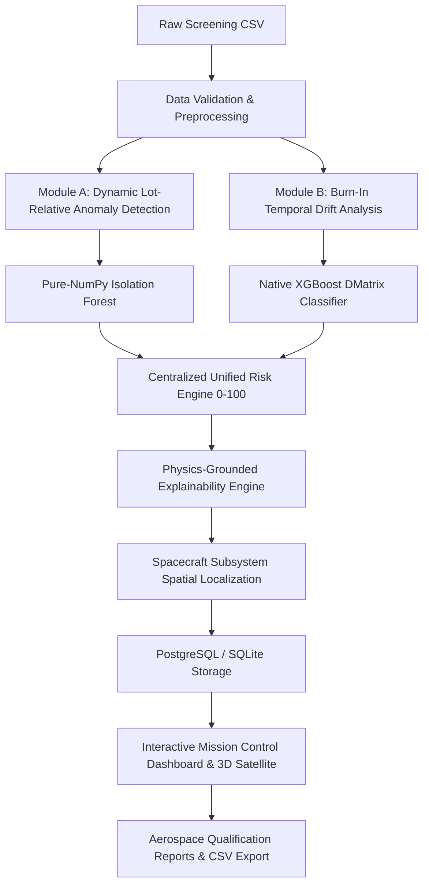

# ASTRA VIGIL — System Architecture

**AI-Driven Anomaly Detection in Component Burn-In & Screening**  
**Problem Statement**: SIH26170 | **Organization**: ISRO / Department of Space | **Theme**: Smart Automation

---

## 1. Overview
ASTRA VIGIL is an aerospace-grade reliability screening platform designed for deployment within an organization's controlled, private, air-gapped infrastructure. It replaces traditional binary datasheet screening with dynamic lot-relative cohort intelligence and physics-based temporal burn-in drift analysis.

---

## 2. Core Architectural Principles
1. **Air-Gapped & Sovereign**: Does not depend on public clouds, developer laptops, or external LLM APIs. Core AI runs locally on internal servers.
2. **Dual-Pipeline Execution**: Combines Module A (spatial peer deviation within wafer lots) and Module B (temporal degradation over 0h, 24h, 96h, and 168h).
3. **Deterministic & Reproducible**: Eliminates arbitrary risk scores. Every score is mathematically derived from physical test measurements.
4. **End-to-End Traceability**: Raw measurements (`raw_v0..v168`) are preserved uncorrupted alongside engineered features and risk decisions.
5. **Interactive 3D Subsystem Localization**: Maps every physical electronic component to one of 11 functional spacecraft equipment bays (Power, Battery, Solar, Flight Computer, Communications, Telemetry, Navigation, Thermal, Sensors, Payloads, Attitude Control).

---

## 3. Technology Stack
- **Frontend**: React 18, TypeScript, Tailwind CSS, Three.js (WebGL 3D satellite visualization), Canvas oscilloscope telemetry charts.
- **Backend API**: Python 3.11+, FastAPI, Uvicorn, SQLAlchemy ORM, Pydantic.
- **AI & Analytics**: NumPy, Pandas, Scikit-learn, XGBoost.
- **Database**: PostgreSQL 15 (containerized production) with SQLite fallback for local developer workstations.
- **Deployment**: Docker, Docker Compose, Nginx reverse proxy.
